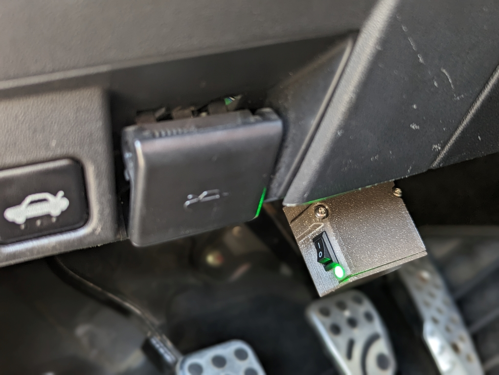
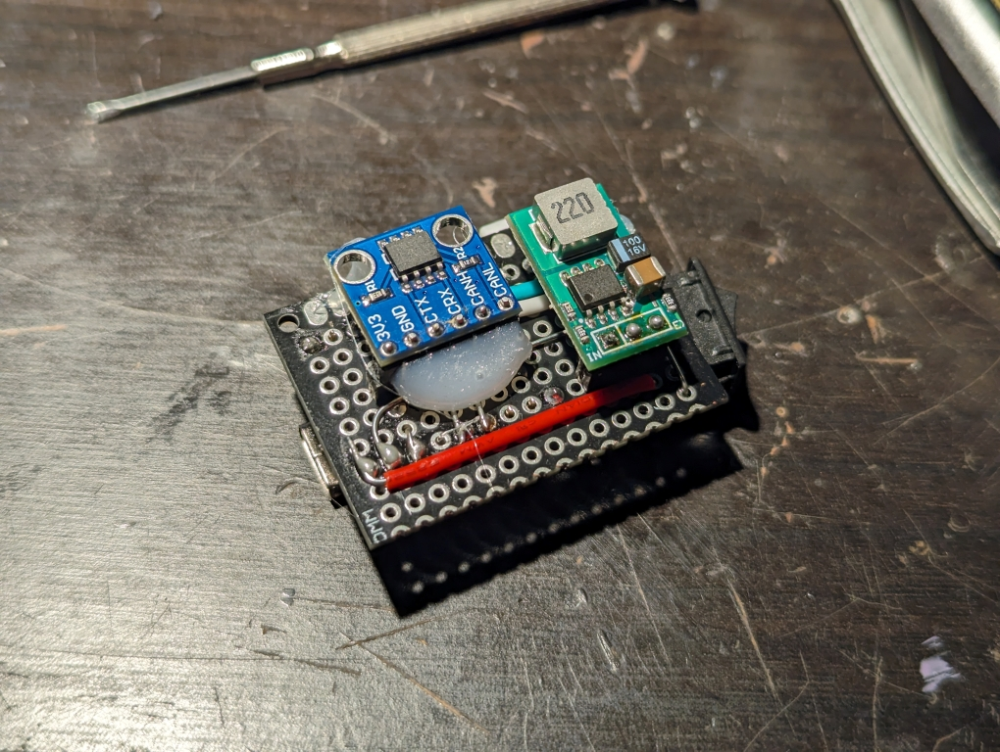
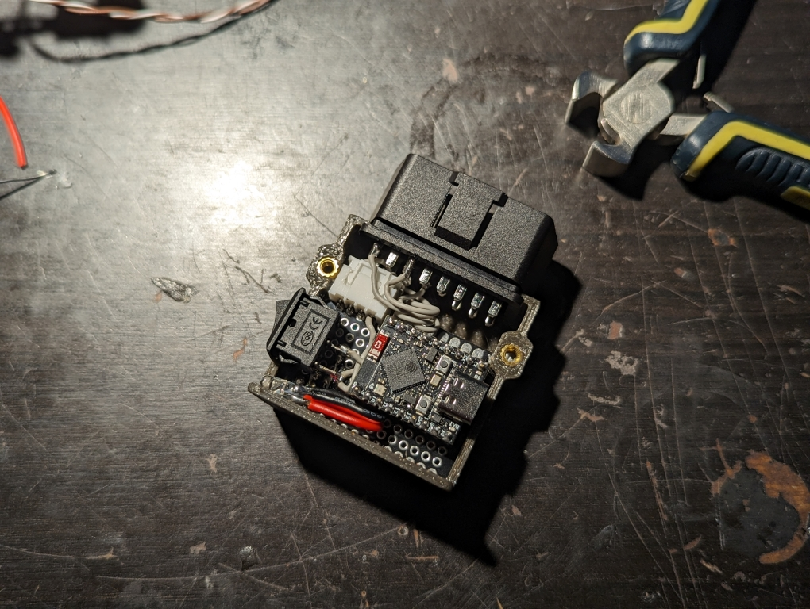

# RaceChrono DIY ESP32

### A Bluetooth DIY CAN-BUS reader based on the ESP32 S3 variant

... based on Arduino.



Yet another one! After using a DIY datalogger [based on the nRF52840 microcontroller](https://github.com/timurrrr/RaceChronoDiyBleDevice), I was inspired by the improved performance discussed on [this forum thread](https://racechrono.com/forum/discussion/2265/esp32-esp32s3-diy-build-progress) to try and build another one based on the ESP32 S3.

Unfortunately, I was never able to get the [linked Github project](https://github.com/joeroback/racechrono-canbus) by Joe Roback / dirtyfreebooter to work properly. I instead decided to try and write my own implementation as a learning opportunity, and here we are.

This project is heavily inspired by the projects mentioned eariler, as well as various existing projects on the [RaceChrono DIY forums](https://racechrono.com/forum/categories/diy-builds).

Special thanks to **Timur Iskhodzhanov / timurrrr ([GitHub](https://github.com/timurrrr))** for his existing nRF52840 project, and his RaceChrono communications library.

This project is licensed under the terms of the MIT license.


## Features

* Supports both ESP32 S3 and C3 variants.
    * Measured performance is similar across both variants, pointing to BLE transmission speed as the real bottleneck.
* Leverages FreeRTOS tasks to distribute CAN and Bluetooth workloads across available cores.
    * Handles both single-core (C3) and dual-core (S3) user-cases.
    * Easily reaches a reported 120Hz, or three times faster than with the nRF52840 (measured on a Google Pixel 7).
    * Actual performance seems to be closer to 200Hz when adding the individual PIDs reported rates.
* Supports per-PID rate-limiting.
* Supports configurable serial logging levels, including debug performance statistics.


## Hardware

For my first iteration, I used an **ESP32-S3 Supermini Development Board** from Aliexpress ([link](https://www.aliexpress.com/item/1005006835920531.html)), combined with a **SN65HVD230 CAN transceiver** breakout board ([link](https://www.aliexpress.com/item/1005005334841319.html)), and a generic 12V to 5V DC-DC buck converter to power the datalogger from the car.

I used an OBD-II male plug ([link](https://www.aliexpress.com/item/1005001622278215.html)) to connect to pin 5 (Ground) and 16 (12V) for power, and pin 6 (CAN high) and 14 (CAN low) for the high speed CAN of my car (Mazda RX-8).

I also added a power switch and a 5V LED to quickly shut it down without unplugging the module, and crammed everything in a custom 3D printed enclosure.






## Required Arduino libraries

* NimBLE-Arduino : https://www.arduino.cc/reference/en/libraries/nimble-arduino
* EasyLogger : https://www.arduino.cc/reference/en/libraries/easylogger
* arduino-RaceChrono : https://github.com/timurrrr/arduino-RaceChrono
    * You will need to install this library manually in your **~/Documents/Arduino/libraries** folder


## Arduino configuration

Feel free to tweak those based on your personal preferences, but keep in mind that Events and Arduino *must* run on Core 1 for proper distribution of tasks.

Here is the configuration I used :

* USB CDC On Boot: **Enabled**
* Events Run on: **Core 1**
* Arduino Runs On: **Core 1**
* Partition scheme: **Default**
* Upload Mode: **USB-OTG CDC (TinyUSB)**
* USB Mode: **USB-OTG (TinyUSB)**
* Upload speed: **115200**


## Configuration options

The **config.h** contains all user-configurable parameters.

A **config.h.example** file is provided, and should be self-explanatory. You must copy or rename that file to **config.h** before compiling the Arduino project.

Here's a quick summary of the parameters available :

* **DEVICE_NAME** : The device name broadcasted via Bluetooth
* **LOG_LEVEL** : The amount of information printed on the serial port
    * Setting this value to **LOG_LEVEL_DEBUG** will also print the number of messages sent and received every 10 seconds.
* **RX_PIN** and **TX_PIN** : The GPIO pins connected to the CAN transceiver
* **CONFIG_BT_NIMBLE_EXT_ADV** : If set to 1, enables BLE 5.0 features
    * In my limited testing, this made no noticeable difference on performance.
* **DEFAULT_UPDATE_RATE_LIMITER** : Specifies a global rate limiter, tracked individually for each PIDs, which limits the amount of updates to 1/n updates, unless defined in the optional PID list below. For example, a value of **10** means that one out of every 10 CAN messages will be send per PIDs.

### Optional per-PID rate limiter
There is also an optional list that allows you to specify a rate-limiting value for each individual PIDs, which allows you to prioritise certain PIDs over others.

For example, for my 2009 Mazda RX-8, I configured the list as follows, which removes the default rate limiter for the PIDs I consider high-priority, and leaves all other PIDs at a rate of 1/10.

```C
uint8_t getUpdateRateLimiter(uint32_t can_id)
{
    switch (can_id)
    {

    case 0x81:    // Steering angle, updates 100 times per second
        return 1; // Do not limit this PID

    case 0x85:    // Brake pressure, brake switch, updates 100 times per second
        return 1; // Do not limit this PID

    case 0x201:   // Speed, RPM, accelerator position, updates ~60 times per second
        return 1; // Do not limit this PID

    case 0x4B0:   // Individual wheel speed, updates 50 times per second
        return 1; // 2Do not limit this PID

    default:
        return DEFAULT_UPDATE_RATE_LIMITER;
    }
}
```